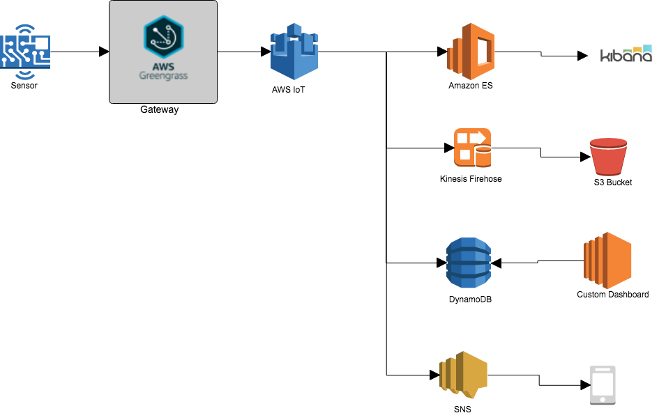

**Rapid Prototyping – IoT Realtime Analytics with ES and Kibana**

**Introduction**

This document contains architecture and implementation guideline to help customer to quickly build IoT Realtime Analytics using AWS services which includes AWS Greengrass, AWS IoT Core, and other AWS analytics services such as ES + Kibana for realtime dashboard, Kinesis Firehose to archive data to S3, DynamoDB for customized dashboard and SNS for event notification.

**Architecture Diagram**

**Implementation Guideline**

**Setup AWS Greengrass and AWS IoT**

- Install GG core
  - Go to AWS Greengrass Console
  - Setup Greengrass group
  - Select easy creation
  - Download the latest Greengrass Core Version
- Start GG Core
  - Extract the GG core to your device
  - cd /greengrass/ggc/core/
  - sudo ./greengrassd start
- Connect Device (IoT Thing) to AWS Greengrass / AWS IoT
  - Go to Greengrass Console
  - Select Group
  - Add device
  - Create new device
  - Download the keys and certificate
  - Configure subscription
- For more information: [https://docs.aws.amazon.com/greengrass/latest/developerguide/gg-gs.html](https://docs.aws.amazon.com/greengrass/latest/developerguide/gg-gs.html)

**AWS IoT – Rules Engine and Action**

- Elasticsearch and Kibana
  - Create and Configure ES domain
    - Choose ES
    - Create new domain
    - Leave all to default
    - For more information: [https://docs.aws.amazon.com/elasticsearch-service/latest/developerguide/es-createupdatedomains.html#es-createdomains](https://docs.aws.amazon.com/elasticsearch-service/latest/developerguide/es-createupdatedomains.html#es-createdomains)
  - Create IoT Rule Action
    - Add action
    - Select ES
    - Choose ES domain name
    - [https://docs.aws.amazon.com/iot/latest/developerguide/iot-rule-actions.html](https://docs.aws.amazon.com/iot/latest/developerguide/iot-rule-actions.html)
- Kinesis Firehose to S3
  - Add Action
  - Select Kinesis Firehose
  - Choose Kinesis Firehose Stream
- DynamoDB Action
  - Add Action
  - Select DynamoDB
  - [https://docs.aws.amazon.com/iot/latest/developerguide/iot-ddb-rule.html](https://docs.aws.amazon.com/iot/latest/developerguide/iot-ddb-rule.html)
- SNS
  - Add Action
  - Choose SNS
  - Choose SNS Topic
  - Choose Message Format
  - Choose IAM Role
  - [https://docs.aws.amazon.com/iot/latest/developerguide/iot-sns-rule.html](https://docs.aws.amazon.com/iot/latest/developerguide/iot-sns-rule.html)